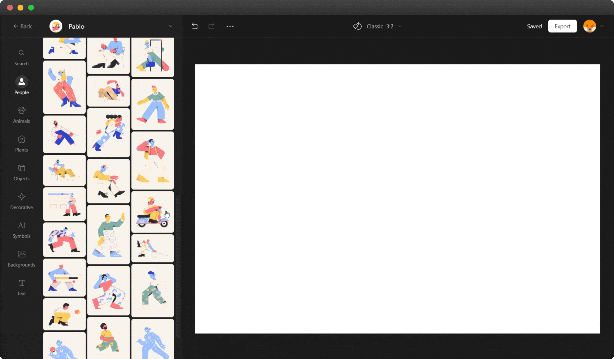

## Overview

Vector Creator is a web-based app that allows even non-designers to produce professional-looking visual content from pre-made elements. It comes with a constantly updated library of more than 10,000 elements drawn by professional artists. You can also upload your photos and illustrations and mix them up with the elements from the library.

## How to use Vector Creator

Using Vector Editor is as easy as one-two-three:

1. Pick up a style and drop the required objects onto the stage.
2. Arrange the scene as needed.
3. Export your resulting masterpiece to PNG or SVG. You’ll get PNGs of up to 800*534 px, which is enough for most cases free for a link. Larger images up to 2,400x1,600 px and SVG will require a subscription.

The editing is intuitive and super easy. You can resize, rotate, flip horizontally and vertically, duplicate, and even crop the elements. Each style has its own specific color scheme, but you can always recolor objects to your liking or to fit your brand colors, or whatever.

In this section you will learn all the basic operations that you can do with objects on the stage.

 ## OK!!!!!!!!!!!